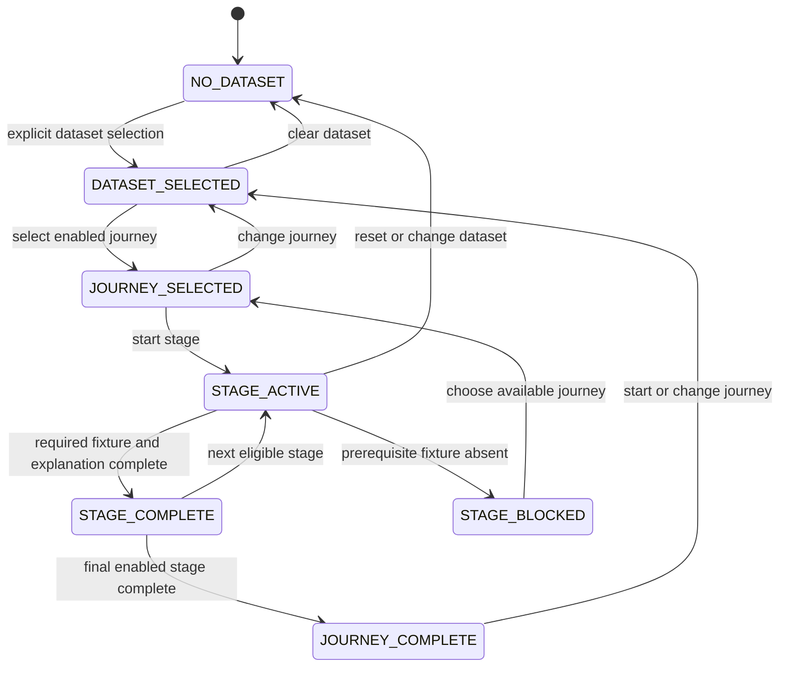

# MIP Chat-First Demo Product Flow and Sample Journey Design 001

**Artifact ID:** `MIP_CHAT_FIRST_DEMO_PRODUCT_FLOW_AND_SAMPLE_JOURNEY_DESIGN_001`
**Status:** implementation-ready design; no runtime, fixture, or test changes
**Verdict:** `PRODUCT_FLOW_DEFINED_FIXTURE_IMPLEMENTATION_NEXT`

## 1. Decision and current-state audit

The canonical experience becomes a conversation-led, explicitly contextual demo.
It must not silently select `saas_subscriptions_demo_v1` or make a claim about
“your data” before the user selects a dataset. The only enabled dataset in this
design is the committed SaaS subscriptions fixture. It has raw spend/KPI,
controls, geo metadata, canonical MMM and GeoX *readiness* panels, expected
answer behavior, and fixture-only calibration context. It does not have a
governed MMM run/export, GeoX design/assignment/readout, applied
`CalibrationSignal`, refreshed MMM result, simulation, or recommendation.

The current `chat_first_history` is an unscoped message list; current sample
prompts are global readiness/guardrail prompts; and the default static **Full MMM
+ GeoX lifecycle walkthrough** is an internal status table. These are replaced
in the future implementation by explicit dataset/journey context and contextual
progress. The existing static table moves to **Advanced tools → Conceptual
lifecycle reference** because it is useful background, but not the user's active
journey.

## 2. Default page information architecture

1. **Hero:** `Marketing Intelligence Platform` and `MMM + GeoX measurement
   copilot`, followed by plain language: understand data requirements, select a
   method, inspect governed evidence, connect MMM and experiments, and learn
   which planning conclusions are trustworthy. It contains no internal artifact
   name or readiness conclusion.
2. **Immediate composer:** an initial assistant welcome, the composer, and short
   onboarding chips appear directly below the hero. Streamlit's current
   `st.chat_input` may be rendered in the main page flow (not constrained to a
   sidebar); implementation should place it in a dedicated composer container
   directly below the hero, with the message thread immediately above it after
   the first turn. If a Streamlit release cannot retain that placement, use a
   normal `st.text_input` plus explicit Send button in the same container, while
   preserving keyboard submit, accessibility label, and message semantics.
3. **Explore a sample measurement journey:** dataset cards appear below the
   initial chat. Dataset selection is an explicit action, never a side effect of
   asking a question.
4. **Journey selection:** visible only after a selected dataset supports one or
   more journeys.
5. **Conversation and artifact workspace:** after journey selection, the thread
   remains primary; current-stage summary, artifact preview, progress, next
   action, and collapsed technical lineage support the active answer.
6. **Secondary navigation:** sidebar **Advanced tools** keeps the legacy
   deterministic tools. Label them “Advanced tools — detailed inspection,” not
   as the default workflow.

The hero, composer, active dataset indicator, and active journey indicator are
always visible. Reset clears messages and all context; **Change dataset** clears
dataset-bound journey/stage/artifact context before selecting a replacement.

### No-dataset experience

Welcome: “I can explain measurement options, the data needed to begin, and a
preloaded sample journey. Select a demo dataset before I make dataset-specific
readiness statements.” Initial chips are:

- What can MIP help me do?
- What data do I need to get started?
- Should I use MMM, GeoX, or both?
- How does MIP decide what results I can trust?
- Walk me through a sample use case.
- How do experiments improve MMM?

No-dataset answers may explain MIP, method roles, governance, and the sample;
they cannot mention active evidence, readiness, artifacts, or “your data.”

### Dataset-card and journey-card contracts

The enabled SaaS card displays: **SaaS subscriptions**, SaaS subscriptions
domain, `paid_conversions` KPI, weekly × DMA grain, Search/Meta/YouTube spend,
promotion/holiday/launch/competitor controls, available readiness/context
artifacts, supported journeys, and **Preloaded deterministic demo — readiness
and explanation** status. It exposes Select, Change, and Clear actions and never
shows a repository path in primary UI. Planned cards, if later added, are
disabled, explicitly marked Planned, and produce no measurement claim.

After selection, show `Active demo dataset: SaaS subscriptions` and only these
cards as enabled when their fixtures exist: Understand the data; Assess MMM
readiness; Explore a GeoX design request; and View the complete sample story up
to its current fixture boundary. Review MMM run, Explain MMM results, Review
experiment evidence, Understand MMM calibration, and Assess planning readiness
are visible as **planned fixture stages**, not enabled, until their listed
fixture artifacts exist. The complete story may traverse them as blocked/future
explanatory stages, never as results.

## 3. Conversation context and state model

Use a UI session-context wrapper over existing MIP fixture, readiness, runtime
ingestion, GeoX, calibration, planning, trust, and recommendation contracts; do
not create a parallel data-domain model. Required fields are:

`active_dataset_id`, `active_journey_id`, `active_stage_id`,
`conversation_messages`, `available_artifact_ids`, `completed_stage_ids`,
`blocked_stage_ids`, `last_answer_category`, `suggested_follow_up_ids`,
`demo_execution_mode`, and `context_revision`.

`context_revision` increments on dataset/journey change; each message records
the revision it was answered against. Messages from an older revision remain
visible as history but are labelled “previous context” and cannot supply current
artifact eligibility.



| Transition | Trigger / prerequisite | State, answer, and UI effect | Claims and prompts |
|---|---|---|---|
| `NO_DATASET → DATASET_SELECTED` | explicit enabled-card selection | set dataset, clear journey/artifacts, identify active demo and available journeys | dataset overview only; enable data/upload/journey prompts |
| `DATASET_SELECTED → JOURNEY_SELECTED` | enabled journey action | set journey and its first stage; show progress at 0 | enable stage prompts; disable output/planning prompts without artifacts |
| `JOURNEY_SELECTED → STAGE_ACTIVE` | start/current-stage prompt | show bounded answer and relevant fixture preview | allow only fixture-supported stage facts |
| `STAGE_ACTIVE → STAGE_COMPLETE` | required fixture present and user completes explanation | add completed stage and expose next eligible stage | offer at most three next-stage follow-ups |
| `STAGE_ACTIVE → STAGE_BLOCKED` | required fixture missing | record missing artifact and a future/blocked answer | refuse result/recommendation; offer available alternative/change direction |
| any → `NO_DATASET` | Clear dataset or Reset | clear dataset, journey, stage, artifacts, suggestions; increment revision | return to platform-only prompts |
| any selected state → `DATASET_SELECTED` | Change dataset | clear incompatible journey/artifacts; increment revision | no stale dataset claims |

Every answer uses this deterministic context hierarchy:

`platform context → active dataset → active journey → active stage → available
artifacts → prior question → claim eligibility`.

The renderer classifies the question as platform-general or dataset-specific,
checks selection, journey, artifact, and claim eligibility, labels it as live,
fixture-backed, explanatory, blocked, or future, then supplies the immediate
next action. Unsupported questions receive a bounded explanation and a relevant
direction change. A changed dataset/journey invalidates prior artifact context.

## 4. Prompt and follow-up policy

Prompt catalogs are state-specific:

| Context | Prompts |
|---|---|
| No dataset | capabilities, required data, MMM vs GeoX, trust, calibration, sample use case |
| Dataset, no journey | overview, fields, what a real user uploads, available journeys, supported questions |
| Data understanding | structure, required columns, grain, missingness, controls, spend/KPI alignment |
| MMM readiness | history, variation, KPI, controls, geo/time compatibility, blockers |
| MMM output | diagnostics, uncertainty, contribution evidence, identification, ranges, allowed/blocked claims |
| GeoX evidence gap | why evidence is weak, experiment relevance, required input, feasibility, estimand, geographic eligibility |
| Calibration | compatibility, `CalibrationSignal`, freshness, uncertainty, scope, applied/downweighted/excluded/informational treatment, before/after |
| Planning readiness | model and simulation readiness, supported range, extrapolation, uncertainty, authorization boundary |

Follow-ups are calculated from `active_dataset + active_journey + active_stage +
answer_category + available_artifacts + blocked_prerequisites`, not from a global
list. Show at most three: immediate next stage first; a blocker-resolution
question second when needed; and one change-direction question only when useful.
Never suggest GeoX merely because it exists, output questions before an output
artifact, or budget movement before model and simulation evidence. Suggest GeoX
only when the active MMM evidence-gap record makes it relevant.

## 5. Golden SaaS sample journey

All stages are explicit about execution mode. “Precomputed demo artifact” means
fixture-backed, not live calculation; “future fixture” means unavailable until
the next fixture task adds it.

| ID | User goal and stage | Artifact / owner / mode | Allowed answer and next action |
|---|---|---|---|
| `select_dataset` | Select SaaS subscriptions; see KPI, 14 weeks, 8 DMAs, 3 channels, controls, demo status | `manifest.json`; MIP; fixture-backed | identify active demo only; choose a journey |
| `upload_requirements` | Understand real uploads | intake requirements derived from manifest and source inventory; MIP; explanatory | explain spend, KPI, controls, calendar, IDs, time/geo grain; distinguish preloaded demo from user uploads; inspect source data |
| `inspect_source` | Inspect inventory, schema, counts/date range, grain, missingness, channel/KPI/control coverage | raw CSV inventory and manifest; MIP; fixture-backed | explain observed structure; inspect canonical panel |
| `canonical_panel` | Inspect normalized MMM panel and lineage | `mmm_weekly_dma_panel.csv`, grain report; MIP; precomputed fixture | explain pivot/KEEP_KPI_ONCE_PER_TIME_GEO; do not claim a live transform; assess readiness |
| `mmm_readiness` | Assess readiness | manifest readiness expectation and expected behavior; MIP; fixture-backed | `PARTIALLY_READY` for readiness only; model/export remains absent; request/replay sample run is planned |
| `mmm_run` | Review a governed MMM run | required sample `MMMRunManifest`, diagnostics, export/result; MMM owner; future fixture | label **Sample governed run — precomputed demo artifact**; no live fit; explain output when fixture exists |
| `mmm_outputs` | Explain run facts | required output explanation envelope; MMM facts, MIP explanation; future fixture | business summary of diagnostics/uncertainty/ranges; no recommendation unless separately authorized |
| `evidence_gap` | Identify uncertainty limiting a claim | required evidence-gap record tied to MMM diagnostics; MIP; future fixture | only use a documented fixture gap (proposed: correlated Meta spend and insufficient calibration evidence); request GeoX design |
| `geox_request` | Request a GeoX workflow through MIP | required `MMMToGeoXDesignBridge` or `StandaloneGeoXDesignRequest`; MIP → GeoX/panel_exp; fixture-backed request | MIP prepares question/channel/KPI/estimand/geo/pre/test/eligibility/constraints/gap ref; GeoX owns feasibility/assignment |
| `geox_evidence` | Review experiment evidence | required governed design response and readout envelope; GeoX/panel_exp with external execution; future fixture | label sample versus real/external output; explain validity and claim boundary, never assign markets in MIP |
| `calibration` | Map evidence to calibration | required compatible `CalibrationSignal`; MIP validates/routes, MMM treats statistically; future fixture | show compatibility, uncertainty, freshness, and applied/downweighted/excluded/informational status |
| `refreshed_mmm` | Compare before/after evidence | required refreshed result plus comparison; MMM facts, MIP explanation; future fixture | state changes/non-changes and remaining limits; calibration does not guarantee improvement |
| `planning_readiness` | Evaluate explanation, simulation, recommendation authorization | required planning-readiness/decision-surface/recommendation evidence; shared boundary; future fixture | separately label explanation, simulation, and authorization; block planning recommendation absent evidence |

The current GeoX panel has Meta spend, `paid_conversions`, DMA eligibility, and
pre/test-candidate periods, but no assignment or lift. The current calibration
JSON is `fixture_context_only` and must not be relabelled as an applied signal.

## 6. Fixture inventory and gap plan

| Fixture stable ID | Current contract to reuse / producer → consumer | Status and minimum fields / restrictions |
|---|---|---|
| `saas_v1_raw_dataset` | `DomainDatasetFixtureManifest`; MIP → UI | available: file inventory, schema, rows, dates, grain; descriptive only |
| `saas_v1_dataset_manifest` | `DomainDatasetFixtureManifest`; MIP → UI | available: identity, KPIs, channels, controls, allowed/forbidden claims |
| `saas_v1_intake_report` | planning/readiness intake contracts; MIP → UI | missing: required/optional columns, missingness, quality findings; no live upload processing |
| `saas_v1_grain_report` | `DomainDatasetGrainCompatibilityReport`; MIP → UI | partial: source/canonical grain and conversion checks; validate KPI-once rule |
| `saas_v1_mmm_panel_preview` | canonical panel plus tabular-source contracts; MIP → UI | available: preview, lineage, conversions, compatibility; precomputed only |
| `saas_v1_mmm_readiness` | readiness report contracts; MIP → UI | partial: manifest expectation; add stable report, evidence, blockers, next artifact |
| `saas_v1_mmm_run_manifest` | `MMMRunManifest`/runtime result contracts; MMM → MIP | missing: run ID, status, input refs, engine version, lineage; sample only |
| `saas_v1_mmm_diagnostics` | `MMMRuntimeDiagnosticsMetadata`; MMM → MIP | missing: diagnostics status, uncertainty, warnings, supported scope; no calculation |
| `saas_v1_mmm_export_result` | `MMMExportBundle`/governed result boundary; MMM → MIP | missing: bounded contribution/effect facts, ranges, claim policy; no ROI/ROAS invention |
| `saas_v1_evidence_gap` | MIP evidence-gap record; MIP → GeoX request/UI | missing: gap ID, diagnostic refs, channel, rationale, required evidence; must match sample MMM diagnostics |
| `saas_v1_geox_design_request` | `MMMToGeoXDesignBridge` / `StandaloneGeoXDesignRequest`; MIP → GeoX | missing: business question, channel, KPI, estimand, geography, periods, eligibility, constraints, gap ref |
| `saas_v1_geox_design_response` | GeoX integration/feasibility contract; GeoX → MIP | missing: feasibility, required inputs, constraints, no fabricated assignment |
| `saas_v1_geox_readout` | `GeoXReadoutResultEnvelope`; GeoX/external → MIP | missing: experiment ID, scope, effect/uncertainty, diagnostics, validity, lineage; clearly sample/external |
| `saas_v1_calibration_signal` | `CalibrationSignal`; MIP → MMM | missing: source/model IDs, mappings, compatibility, uncertainty, freshness, weight, diagnostics, permitted treatment |
| `saas_v1_refreshed_mmm_result` | MMM runtime/governance result; MMM → MIP | missing: linked pre/post evidence, status, uncertainty comparison, claim boundary |
| `saas_v1_calibration_comparison` | MIP explanation envelope; MIP → UI | missing: what changed/not changed, treatment, limitations; no claim of improvement |
| `saas_v1_planning_readiness` | planning eligibility, `DecisionSurface`, `RecommendationContract`; shared → UI | missing: simulation support/range/extrapolation/uncertainty/authorization; recommendation stays blocked until contracts authorize |

`MIP_CHAT_FIRST_DEMO_SAMPLE_JOURNEY_FIXTURES_001` owns creating these missing
deterministic fixtures and golden validation cases. It must validate stable IDs,
cross-artifact lineage, execution-mode labels, artifact availability gates,
claim restrictions, no fabricated metrics, and a blocked recommendation when
authorization is absent. Existing raw, manifest, panel, GeoX-readiness, and
context-only calibration fixtures are reusable; they do not make later stages
available merely by existing.

## 7. Ownership and claim boundary

| Capability | MIP | MMM | GeoX/panel_exp | External |
|---|---:|---:|---:|---:|
| Dataset selection/context and intake explanation | owner | evidence consumer | evidence consumer | user source |
| MMM readiness orchestration | owner | technical evidence | no | no |
| MMM fitting and diagnostics | orchestrates/gates | owner | no | no |
| Evidence-gap identification | orchestrates/explains | supplies evidence | no | no |
| GeoX design request | owner | no | consumes | no |
| Market assignment/design | no | no | owner | no |
| Experiment execution | no | no | supports | owner |
| GeoX readout | ingests/explains | no | owner | execution source |
| CalibrationSignal validation | owner | consumes | supplies source evidence | no |
| Statistical calibration treatment | routes | owner | no | no |
| Planning simulation | orchestrates/gates | computes | no | no |
| Recommendation authorization | owner/governance | evidence | evidence | human approval |
| User-facing LLM response | owner | no | no | provider only when authorized |

MMM never directly calls GeoX. MIP orchestrates a request, GeoX evaluates
feasibility/design, an experiment executes externally, MIP ingests governed
evidence, and MMM consumes compatible calibration evidence under its own
statistical governance. An LLM may explain authorized data; it does not fit,
calculate effects, assign markets, or authorize claims. Simulation and
recommendation are separate: simulation requires a supported MMM model/range;
recommendation additionally requires decision-surface, diagnostics, provenance,
and governance authorization.

## 8. Contextual progress and responsive wireframes

Progress first appears after journey selection. It shows completed stages,
current stage, blocked/future stage with reason, immediate next stage, and
optional stages. Reset/change journey removes it; change dataset removes all
dataset-bound progress. Technical details remain collapsed.

```text
1. NO DATASET / desktop
[Marketing Intelligence Platform | MMM + GeoX measurement copilot]
[assistant welcome + message thread] [Composer: Ask a question]
[onboarding chips]
[Explore a sample measurement journey: SaaS subscriptions card / Select]
[Advanced tools in sidebar]

2. DATASET SELECTION
[Hero] [Composer] [Active demo dataset: none]
[SaaS subscriptions: KPI, weekly×DMA, channels, controls, readiness demo]
[Select] [planned datasets disabled] [technical details collapsed]

3. DATASET SELECTED / no journey
[Hero] [Active demo dataset: SaaS subscriptions | Change | Clear]
[Conversation + Composer] [dataset overview prompts]
[Journey cards: enabled data/readiness/GeoX request; future output/calibration/planning]

4. DATA UNDERSTANDING
[Hero/context] [thread + Composer]
[Journey: Understand the data | progress: source data active]
[artifact preview: inventory/schema/grain/missingness] [up to 3 contextual prompts]
[technical lineage expander]

5. MMM OUTPUT / future fixture state
[Hero/context] [thread + Composer]
[Journey progress: MMM output blocked—sample run/export fixture required]
[blocked artifact card + next action] [no result or budget prompt]
[technical details]

6. GEOX EVIDENCE GAP
[Hero/context] [thread + Composer]
[progress: evidence gap active] [gap card + GeoX request preview]
[prompts: why gap / required GeoX input / change direction]
[technical details]

7. CALIBRATION / future fixture state
[Hero/context] [thread + Composer]
[progress: calibration blocked pending compatible GeoX readout]
[compatibility/treatment card; context-only current signal distinctly labelled]
[technical details]

8. PLANNING READINESS / future fixture state
[Hero/context] [thread + Composer]
[progress: planning blocked pending model/simulation/authorization evidence]
[separate explanation | simulation | recommendation labels]
[technical details]

9. NARROW LAYOUT
[Hero] [active dataset/journey badges] [Composer]
[thread] [one-column artifact/progress cards] [prompt chips] [expanders]
[Advanced tools navigation at bottom/sidebar drawer]

10. ADVANCED NAVIGATION
[Sidebar: Measurement copilot (default); Advanced tools]
[Advanced tools: advisory, readiness reports, calibration mapping, profiling, intake]
```

## 9. Scripted conversation examples

Primary responses are business language; technical names are optional details.

1. **New user:** “What can MIP help me do?” → Explain requirements, method
selection, evidence, and trustworthy conclusions; invite dataset selection.
2. **Upload question:** “What would I upload?” → Explain spend/KPI/controls,
time and geo identifiers, calendar; say uploads are not active in this demo.
3. **Select SaaS:** “Use the SaaS subscriptions sample.” → Confirm active demo,
describe KPI/grain/channels/controls, offer journeys.
4. **Readiness:** “Is this sample ready for MMM?” → Identify the active demo and
say readiness can be inspected; no fitted model claim.
5. **Sample run:** “Show a sample MMM run.” → Until fixture exists, explain the
required precomputed governed run artifact; do not imply fitting.
6. **Outputs:** “Explain the MMM results.” → Until output fixture exists, state
there are no governed result facts to explain; point to missing artifact.
7. **Channel uncertainty:** “Why is Meta uncertain?” → Only after evidence-gap
fixture: explain its documented diagnostic; otherwise state the gap is not yet
available.
8. **GeoX proposal:** “Could an experiment help?” → When a qualifying gap exists,
describe a GeoX design request, not assigned markets or predicted lift.
9. **GeoX evidence:** “What did the experiment show?” → Only with a sample or
external readout; label source/validity/uncertainty and boundaries.
10. **Calibration:** “How does this calibrate MMM?” → Explain compatibility and
MMM-owned treatment; current context-only signal is not applied.
11. **Refresh:** “What changed after calibration?” → Only use pre/post fixture;
state changes and non-changes without claiming improvement.
12. **Planning:** “Can I move budget?” → Block until simulation and
recommendation authorization artifacts exist.
13. **Unsupported:** “Which creative will win?” → State supported scope and
offer a relevant onboarding or active-stage prompt.
14. **Blocked claim:** “What is Meta ROAS?” → Explain it is blocked and name the
governed output required; do not invent a number.
15. **Dataset change:** “Switch samples.” → Clear journey/artifacts, label old
messages previous context, return to dataset selection.

## 10. Future implementation acceptance criteria

The implementation passes only when: (1) no dataset-specific answer precedes
explicit selection; (2) selection is visible/changeable/clearable; (3) initial
prompts are onboarding-oriented and composer immediately accessible; (4) dataset
and journey cards reflect only real or explicitly planned fixtures; (5) one SaaS
golden journey is deterministic; (6) upload requirements distinguish demo from
user data; (7) stage/answer-specific follow-ups limit to three; (8) default page
has no static lifecycle table and progress follows active journey; (9) execution
mode and precomputed artifacts are plainly labelled; (10) MMM does not call
GeoX; (11) technical lineage progressively discloses; (12) blocked claims,
simulation, and recommendation authorization remain separate; (13) legacy tools
remain secondary; (14) desktop/narrow layouts and reset/stale-context behavior
are tested; (15) every sample journey has golden tests; and (16) the `-e .`
public deployment contract remains unchanged.

## 11. Next task

`MIP_CHAT_FIRST_DEMO_SAMPLE_JOURNEY_FIXTURES_001` implements the deterministic
fixture bundle and golden contracts required by this design. Only then should
`MIP_CHAT_FIRST_DEMO_PRODUCT_FLOW_IMPLEMENTATION_001` change the UI.
